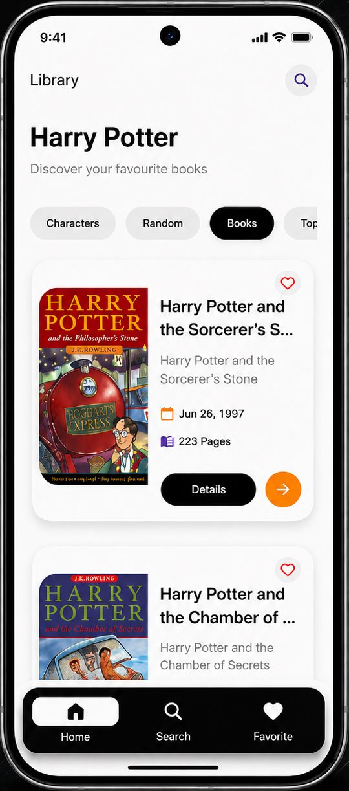
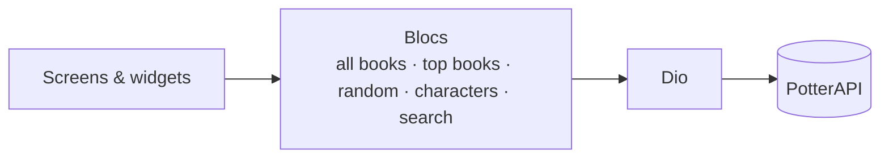

# Harry Potter Library

A Flutter app for exploring the Harry Potter books and characters, built on the free public PotterAPI.

<p align="center">
  
  <br/>
  <sub>Library screen (from the project's promotional mockup)</sub>
</p>

## Features

- **Books** — the full book list, top books and a random book pick.
- **Characters** — character list with a details page for each character.
- **Book details** — release date, page count and description.
- **Search** — search books by title through the API.
- **Favorites** — mark books and characters as favorites (kept for the current session; not saved after the app closes).
- **Skeleton loading** — placeholder skeletons while data loads.
- Splash and onboarding screens, category tabs and bottom navigation.

## Tech Stack

| | |
|---|---|
| Framework | Flutter · Dart |
| State management | Bloc (`flutter_bloc`) · Equatable — one Bloc per feature |
| Networking | Dio · [PotterAPI](https://potterapi-fedeperin.vercel.app) (no API key required) |
| UI | Skeletonizer |

## Architecture



```
lib/
├── core/           # API URLs, colors, favorites manager
├── data/           # book and character models
├── logic/          # one Bloc per feature
└── presentation/   # screens and widgets
```

## Getting Started

Requirements: Flutter with Dart SDK `^3.8.1`. No API key is needed.

```bash
git clone https://github.com/esllamesso/Harry-Potter-LIB---App.git
cd Harry-Potter-LIB---App
flutter pub get
flutter run
```

## Disclaimer

This is an unofficial fan project for portfolio purposes. It is not affiliated with or endorsed by J.K. Rowling, Warner Bros. or Wizarding World. Book covers and character data come from PotterAPI.

## Author

**Islam Mohamed Hassan** — Flutter Developer · AI & Digital Marketing Specialist · Flutter Instructor
[Portfolio](https://eso-portfolio-psi.vercel.app) · [LinkedIn](https://www.linkedin.com/in/eslam-mohamed-9ba442297/) · [GitHub](https://github.com/esllamesso)

---

© Islam Mohamed Hassan. All rights reserved. This repository is shared for portfolio purposes; no open-source license is granted.
